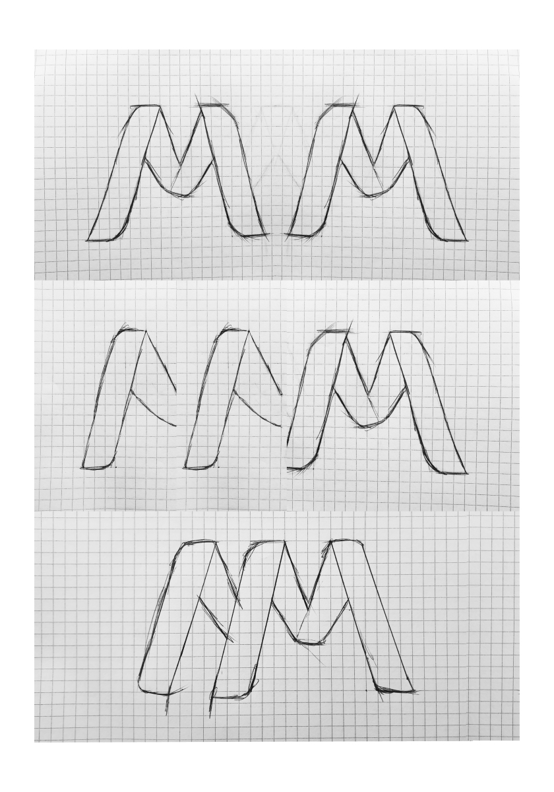
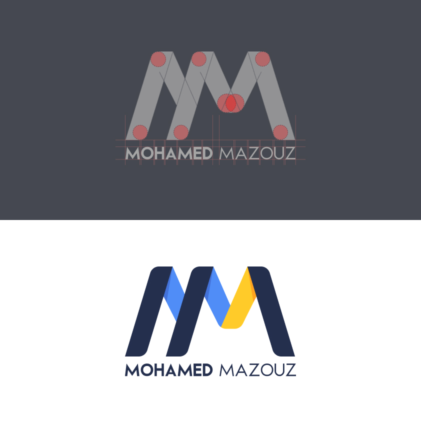
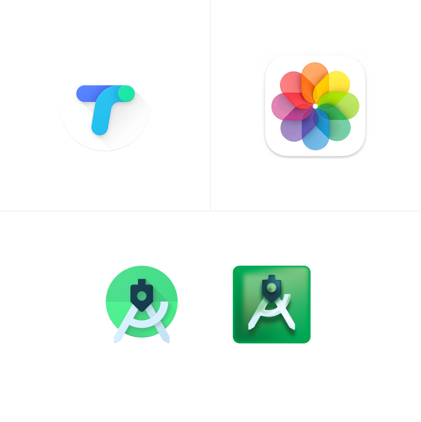
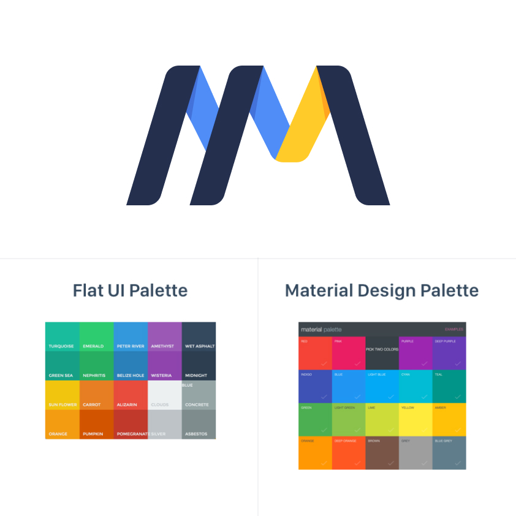

  

<h2 align="center">
    
    Main LOGO

</h2>

A personal logo for a designer is quite important as it presents the designer's style, choices, and what he is capable of, and most importantly it helps to build an early perspective by a potential client.

I always wanted the logo idea to be based on a concept that could be developed from scratch. However, as I delved into the design, I wanted it to be grounded in a conceptual idea that could be developed from scratch. Ultimately, to be able to make a final version that I can be proud of.

The logo idea is based on a combination between the first two letters from the name "Mohamed MAZOUZ" “M M” in the form of a simple and remarkable symbol based on a minimal style. And supported by a collection of colors that will demonstrate clearly the combination between the two letters M M

* The blue which represents the cold colors.
* The yellow which represents the warm colors.
* The dark blue for the for the remaining components

The idea is to create a chromatic balance between the two colors categories and most importantly to make the letters combination clear and significant to the viewer.

  

  

# Logo Sketches
As I mentioned before, I always wanted the logo idea to be based on a concept that could be developed from scratch in order to create a meaningful logo that would make viewers think about and understand it easily.
As shown is the presented sketches, the logo symbol has three components; each one of them contains two layouts. 

Starting from the right side: 
* The first two components refer to the M letter from the first name.
* Whereas, the third one refers to the the M letter from the surname, but hidden in back.
This is supported with three main colors in order to make the merge smooth and clear to the viewers.

  

  

  

